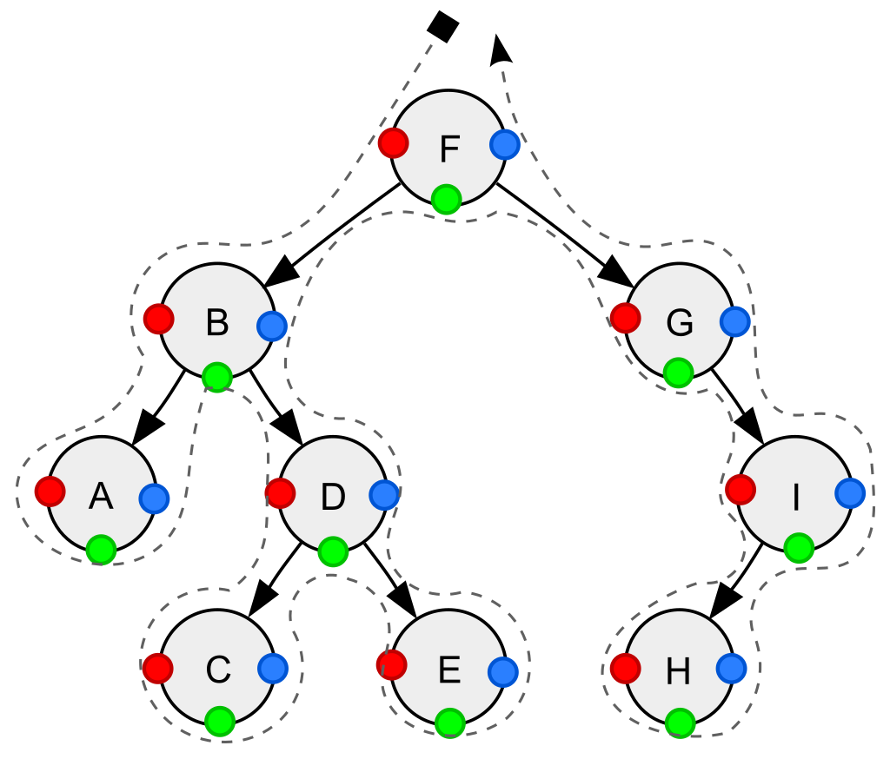
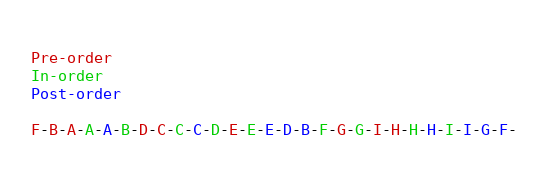

# configurable-tree-traversal

Can do depth-first traversals like on this picture for abstract trees.



(source: https://en.wikipedia.org/wiki/Tree_traversal)

## Examples

To run examples you'll need to have [node](https://nodejs.org/en/download/) and you'll need to run `npm install`.

### [tree-from-image-example.ts](./tests/tree-from-image-example.ts) 

`npm run tsfile tests/tree-from-image-example.ts`

```typescript
const treeData =
  { $d: 'F', $c: [
      { $d: 'B', $c: [
          { $d: 'A', $c: [] },
          { $d: 'D', $c: [
              { $d: 'C', $c: [] },
              { $d: 'E', $c: [] }] }] },
      { $d: 'G', $c: [
          null,
          { $d: 'I', $c: [
              { $d: 'H', $c: [] }] }] }] };

const traversal = new DepthFirstTraversal({ traversableTree: { makeRoot: () => treeData, makeVertex: (childHint: any) => childHint } });
traversal.addVisitorFor(DepthFirstTraversalOrder.PRE_ORDER, (vertex) => reportVisit(DepthFirstTraversalOrder.PRE_ORDER, vertex.getData()));
traversal.addVisitorFor(DepthFirstTraversalOrder.IN_ORDER, (vertex) => reportVisit(DepthFirstTraversalOrder.IN_ORDER, vertex.getData()));
traversal.addVisitorFor(DepthFirstTraversalOrder.POST_ORDER, (vertex) => reportVisit(DepthFirstTraversalOrder.POST_ORDER, vertex.getData()));
traversal.makeRunner().run();
```

Stdout



### [traversable-object-example.ts](./tests/traversable-object-example.ts) 

`npm run tsfile tests/traversable-object-example.ts`

### [traversable-object-iterable-example.ts](./tests/traversable-object-iterable-example.ts) 

`npm run tsfile tests/traversable-object-iterable-example.ts`

### [rewrite-object-example.ts](./tests/rewrite-object-example.ts) 

`npm run tsfile tests/rewrite-object-example.ts`

# Project Status

Not tested beyond examples given and never yet applied to real-life problems.

If for some reason you want to use this as a dependency, please use fixed version (remove ^ from version
of `configurable-tree-traversal` in package.json)

# TODO

1. Breadth-first
2. Add self-reference test
3. --
4. Async traversal
5. Implementation for FS (with a way to keep fs and tree in sync)
6. Unit tests
7. Freeze data at some point? make trees/vertices immutable?
8. Benchmarks
9. Breadth-first traversal
