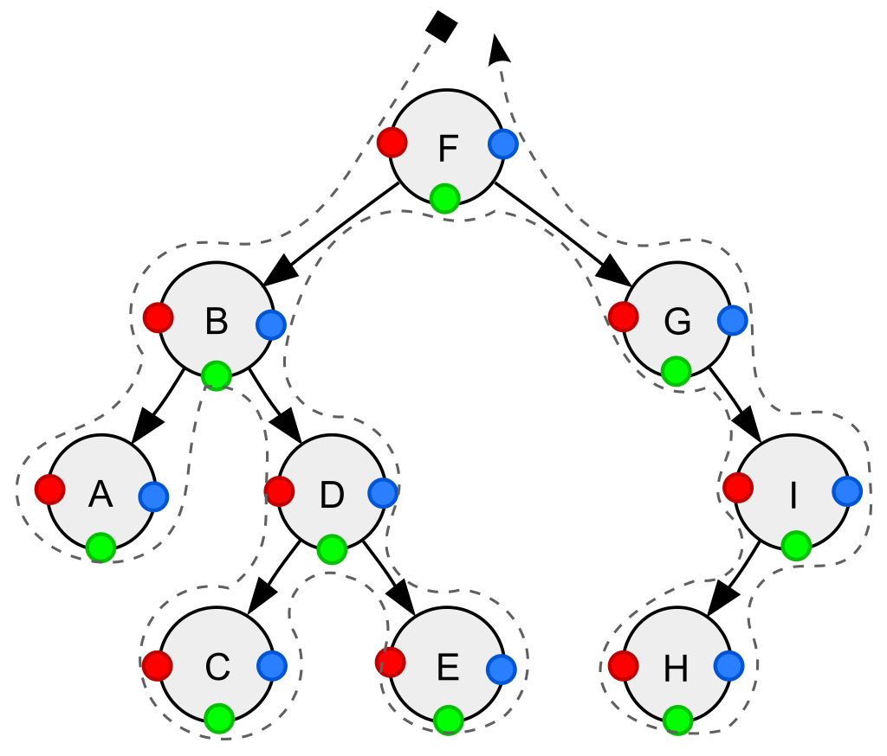

# configurable-tree-traversal

Configurable, synchronous tree traversal for TypeScript and JavaScript. Walk abstract trees or JavaScript objects in depth-first or breadth-first order, transform vertices, prune branches, and pause and resume traversal.



Depth-first visit points: red for pre-order, green for in-order, and blue for post-order.
Source: [Wikipedia — Tree traversal](https://en.wikipedia.org/wiki/Tree_traversal).

Package: [configurable-tree-traversal on npm](https://www.npmjs.com/package/configurable-tree-traversal)

```sh
npm install configurable-tree-traversal
```

The package includes CommonJS JavaScript and TypeScript declarations. Node ESM consumers can use the default import (`import library from 'configurable-tree-traversal'`).

## Traverse an object

```ts
import {
  DepthFirstTraversal,
  DepthFirstTraversalOrder,
  TraversableObjectTree,
} from 'configurable-tree-traversal';

const traversal = new DepthFirstTraversal({
  traversableTree: new TraversableObjectTree({ a: { b: 1 }, c: 2 }),
});

const runner = traversal.makeRunner();
for (const { vertex, vertexRef } of runner.getIterable({
  iterateOver: [DepthFirstTraversalOrder.PRE_ORDER],
})) {
  const path = runner
    .getResolvedTree()
    .getPathTo(vertexRef, { noRoot: true })
    .map((ref) => ref.unref().getData().key);
  console.log(path, vertex.getData().value);
}
// Paths: [], ['a'], ['a', 'b'], ['c']
```

The object adapter creates a synthetic root representing the whole input. Each vertex contains `{ key, value }`. Arrays use numeric index keys; objects include their own enumerable string and symbol keys. Sparse array holes are skipped. Non-enumerable and inherited properties are excluded. Property access may invoke getters.

Ancestor cycles throw a descriptive error before descent; shared objects in separate branches are traversed independently. The same adapter can be used by multiple runners. Use `makeVertexHook` to skip or customize properties, or `getChildrenOfProperty` to define traversal for specialized values.

## Abstract trees

A tree adapter supplies `makeRoot()` and `makeVertex(hint, options)`. Both return `{ vertexContent }`, where content is `{ $d: data, $c: childHints }`. Return `{ vertexContent: null }` for an empty tree or a skipped child.

```ts
import {
  DepthFirstTraversal,
  DepthFirstTraversalOrder,
  type TreeTypeParameters,
} from 'configurable-tree-traversal';

type Node = { $d: string; $c: Node[] };
type Tree = TreeTypeParameters<string, Node>;
const root: Node = {
  $d: 'A',
  $c: [
    { $d: 'B', $c: [{ $d: 'D', $c: [] }] },
    { $d: 'C', $c: [] },
  ],
};
const traversal = new DepthFirstTraversal<Tree>({
  traversableTree: {
    makeRoot: () => ({ vertexContent: root }),
    makeVertex: (hint) => ({ vertexContent: hint }),
  },
});
traversal.addVisitorFor(DepthFirstTraversalOrder.POST_ORDER, (vertex) => {
  console.log(vertex.getData());
});
traversal.makeRunner().run(); // D, B, C, A
```

Child vertices are resolved lazily. Resolution options include the parent reference, depth, hint index, and the tree resolved so far. Custom adapters are responsible for detecting cycles in their own graph representation. Both strategies use iterative scheduling and can traverse deeply nested trees without recursive call-stack growth.

## Traversal orders

| Strategy      | Order         | When a vertex is visited                        |
| ------------- | ------------- | ----------------------------------------------- |
| Depth-first   | `PRE_ORDER`   | Before its children                             |
| Depth-first   | `IN_ORDER`    | At configured child boundaries; once for a leaf |
| Depth-first   | `POST_ORDER`  | After its children                              |
| Breadth-first | `LEVEL_ORDER` | Level by level, with siblings in hint order     |

Iteration emits events even when no visitor functions are registered. By default, depth-first iteration includes all three orders. `sortChildrenHints` receives a shallow copy of each vertex's hints; return the desired child order. Resolution `hintIndex` refers to that resulting order.

In-order traversal defaults to visiting between children, and after the child of a one-child parent. Configure it with:

```ts
traversal.configure({
  inOrderTraversalConfig: {
    visitParentAfterChildren: 0,
    visitParentAfterChildrenAllRangesOutOfBoundsFallback: -2,
    visitUpOneChildParents: true,
    considerVisitAfterNullContentVertices: true,
  },
});
```

Child positions start at zero; negative positions count from the end. A pair such as `[0, -2]` is an inclusive range. Use `{ ranges: [0, 2] }` for multiple positions. The fallback is used only when all primary ranges are out of bounds. Null hints always count toward traversal completion; the last option controls whether they also trigger an in-order visit.

## Breadth-first traversal

```ts
import {
  BreadthFirstTraversal,
  TraversableObjectTree,
} from 'configurable-tree-traversal';

const traversal = new BreadthFirstTraversal({
  traversableTree: new TraversableObjectTree({ a: { b: 1 }, c: 2 }),
});
const keys = [...traversal.makeRunner().getIterable()]
  .filter((event) => !event.isTreeRoot)
  .map((event) => event.vertex.getData().key);
// ['a', 'c', 'b']
```

Register visitors using `BreadthFirstTraversalOrder.LEVEL_ORDER`. `traverseBreadthFirst(tree, visitor, config?)` creates and runs a traversal. The corresponding depth-first helper is `traverseDepthFirst(tree, { preOrderVisitor?, inOrderVisitor?, postOrderVisitor? }, config?)`. Both helpers return the runner; pass `null` in place of visitors to just resolve the tree.

## Visitors and commands

Visitors receive `(vertex, options)` and may return `{ commands: [...] }`. Commands apply to the resolved tree; they do not mutate the original input object.

| Command                             | Effect                                                                       |
| ----------------------------------- | ---------------------------------------------------------------------------- |
| `NOOP`                              | No change                                                                    |
| `HALT_TRAVERSAL`                    | Pause after the current visitor's command batch                              |
| `DELETE_VERTEX`                     | Remove the vertex and its resolved descendants, and skip pending descendants |
| `REWRITE_VERTEX_DATA`               | Replace data using `{ newData }`, including `null` or `undefined`            |
| `DISABLE_SUBTREE_TRAVERSAL`         | Skip remaining descendants while retaining this vertex                       |
| `REWRITE_VERTEX_HINTS_ON_PRE_ORDER` | Replace pending child hints using `{ newHints }` before descent              |
| `SET_VERTEX_VISITORS_CHAIN_STATE`   | Pass `{ vertexVisitorsChainState }` to the next sequential visitor           |

Hint rewriting is accepted during depth-first pre-order or breadth-first level-order and throws at other orders. Deleting the root produces an empty resolved tree. Deleted vertices have no further visitor calls or yielded events.

Visitors have a numeric `priority` (default `100`; higher runs earlier). Equal priorities retain registration order. By default, each visitor's commands are applied before the next visitor runs. With `resolutionStyle: TraversalVisitorFunctionResolutionStyle.CONCURRENT`, all concurrent visitors run first, and their commands apply after that group completes. These are synchronous callbacks; `CONCURRENT` describes command timing, not parallel or asynchronous execution.

Visitor options include `resolvedTree`, `vertexRef`, `order`, root flags, and per-order indices. `vertexVisitIndex` and `curVertexVisitorVisitIndex` start at zero. `previousVisitedVertexRef` points to the preceding vertex for that order, or `null` on its first visit. Chain state starts at `null` for each visit. Each runner takes a snapshot of the configured visitor records and in-order configuration. Configuration copies include nested in-order ranges and iteration filter arrays. Exported traversal defaults are frozen; use constructor options or `configure()` to customize a traversal.

## Pause and resume

```ts
import {
  DepthFirstTraversal,
  DepthFirstTraversalOrder,
  TraversableObjectTree,
  TraversalVisitorCommandName,
} from 'configurable-tree-traversal';

const traversal = new DepthFirstTraversal({
  traversableTree: new TraversableObjectTree({ a: 1, b: 2 }),
});
traversal.addVisitorFor(DepthFirstTraversalOrder.PRE_ORDER, (vertex) => {
  if (vertex.getData().key === 'a') {
    return {
      commands: [{ commandName: TraversalVisitorCommandName.HALT_TRAVERSAL }],
    };
  }
  return undefined;
});
const runner = traversal.makeRunner().run(); // HALTED
runner.run(); // finishes the remaining visitors and traversal
```

Breaking a `for...of` iteration also pauses the runner. Resume the same runner with `run()` or a new `getIterable()` call. Completed visitors and yielded events are not repeated. A halt can occur even when its order is excluded from iteration. The halted event is yielded after its visitor chain completes on resumption.

`getIterable()` accepts `iterateOver`, `enableVisitorFunctionsFor`, and `disableVisitorFunctionsFor`. An enable list takes precedence over a disable list. Passing a new config when resuming replaces iteration options with defaults plus that config; omitting it keeps the previous options. A partially executed visitor chain completes before new filters apply to the next event. Only one iterator may be active per runner; close it with `return()` or a loop break before resuming elsewhere.

Statuses are `INITIAL`, `RUNNING`, `HALTED`, `FINISHED`, and `FAILED`. Running a finished runner has no effect; use `makeRunner()` for a fresh traversal. Errors from adapters, visitors, sorting, or traversal execution propagate and leave the runner `FAILED`. Later attempts to run or iterate it rethrow the original thrown value. Its partially resolved tree remains available for inspection; retry with a fresh runner after correcting the cause.

An error in the consumer's `for...of` body closes that iterator and leaves the runner `HALTED`, so it can be resumed. Runners are in-memory continuations, not serializable checkpoints. Advanced callers injecting `traversalRunnerInternalObjects` must provide mutually consistent state and resolved-tree storage, including the saved tree and reference map when saving original vertices.

## Rewrite objects

The `rewriteObject` namespace is retained for compatibility:

```ts
import { rewriteObject } from 'configurable-tree-traversal';

const input = { keep: 1, remove: 2, nested: [3] };
const { outputObject } = rewriteObject.rewriteObject(input, {
  rewrite: ({ key, value }) => {
    if (key === 'remove') return { delete: true };
    if (typeof value === 'number') return { rewrite: { value: value * 10 } };
    return undefined;
  },
});
// { keep: 10, nested: [30] }; input is unchanged
```

Rewrites run in post-order. Return `{ rewrite: { key, value } }` to rename or replace a property, `{ delete: true }` to remove it, or `undefined` to retain it. Composite parents are reconstructed from their processed children. Arrays are compacted after skipped/deleted elements. Null and undefined values are retained; deleting the root returns `null`.

Set `assembleCompositesBeforeRewrite: true` to receive `assembledComposite` alongside the original property. Options include `isArray`, `isObject`, `isComposite`, and `getKeyPath({ noRoot: true })`. Custom `isArray`/`isObject` and `assembleArray`/`assembleObject` functions support specialized reconstruction. Default reconstruction is for plain objects and arrays; it does not preserve prototypes, descriptors, collection types, or identity shared between branches.

`outputObject` captures the root value when the helper returns (after the optional `getOutputObjectFromRootValue` conversion). If custom visitors halt traversal, check `traversalRunner.getStatus()` before treating that value as complete. Resume with `traversalRunner.run()` and read the final value from `traversalRunner.getResolvedTree().getRoot()?.unref().getData().value`, using `null` when the root was deleted. Resuming does not update the earlier `outputObject` or rerun the output conversion hook.

With `saveNotMutatedResolvedTree: true`, visitors can inspect a separate original resolved tree. Its vertex references, child lists, and resolution contexts are independent of command-driven changes. Vertex data is shallowly shared, so direct mutation of user data is not an immutable snapshot. The saved tree contains only vertices actually resolved during traversal.

`ResolvedTree.getPathTo(ref, { noRoot?, noSelf? })` returns the resolved ancestry in root-to-vertex order and throws if the reference is absent from that tree. Saved-tree paths use saved references from `notMutatedResolvedTreeRefsMap`. Deleting a resolved vertex removes its resolved descendants and detaches it from its parent; deleting the root clears the root pointer.

## API compatibility

Namespace exports `core`, `depthFirstTraversal`, `traversableObjectTree`, and `rewriteObject` remain available, alongside `breadthFirstTraversal` and named exports for traversal classes, helpers, and types. Historical deep imports such as `configurable-tree-traversal/core/Vertex` also work.

Corrected behavior includes independent iteration, reliable halt/resume, terminal error handling, sorting, subtree deletion, and zero-based visitor indices. Root deletion and rewriting null now return null instead of throwing; the rewrite result type accounts for that. See [CHANGELOG.md](CHANGELOG.md) for the full list.

## Development

```sh
npm ci
npm run check         # types, lint, coverage, examples, build, packed consumers
npm test -- tests/traversal-combinations.test.ts
npm run test:coverage
npm run build-watch
npm run benchmark -- 50000
npm run tsfile -- examples/tree-from-image-example.ts
```

The tests cover deterministic generated trees, mutations, pause/resume, failures, original-tree isolation, object reconstruction, deep chains, and wide trees. `npm run check` requires 100% statements, branches, functions, and lines across all source files and executes every example. See [the testing guide](docs/testing.md) for the test layout and regression workflow.

The packed consumer check runs CommonJS, ESM, and strict TypeScript imports from a temporary extracted tarball, using installed runtime dependencies. It checks both classic Node and Node16 TypeScript resolution, public subpaths, and historical deep imports. It uses `tar` and runs in CI on Linux. CI checks Node 22 and 24. No package is published by the verification commands. The benchmark compares deep and wide trees with both traversal strategies; timings depend on the machine and are not performance guarantees.

Async traversal and filesystem synchronization are outside the synchronous API. User vertex data is not frozen. Custom graph adapters must define their own identity and cycle policy.

MIT licensed.
